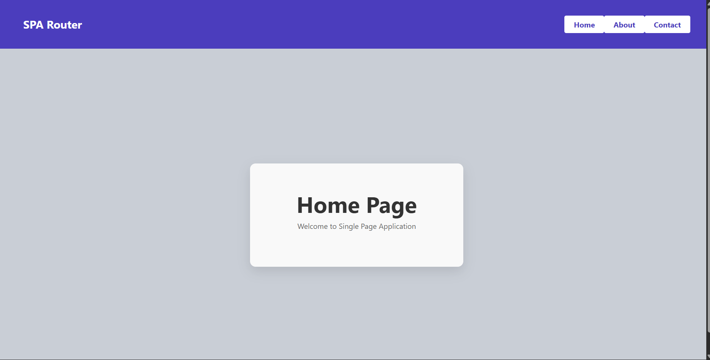
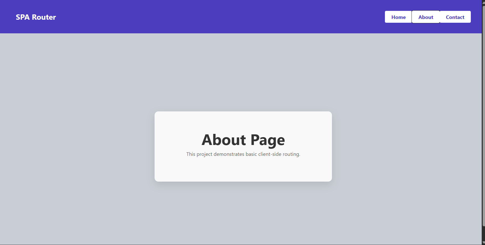
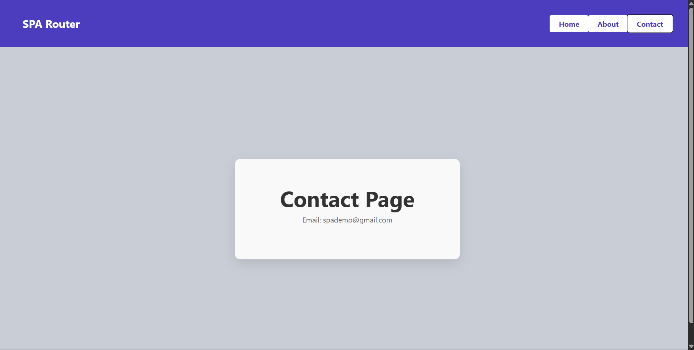
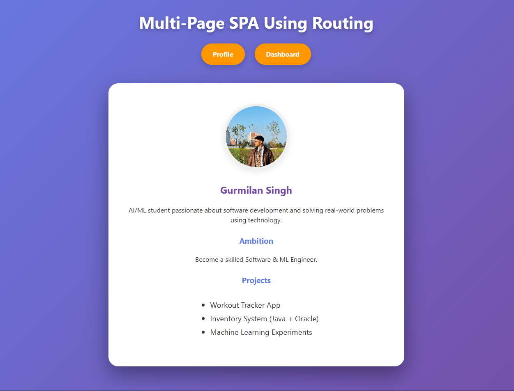

# 🚀 Unit–3: Implementing Routing in Single Page Applications (SPA)

This repository contains two experiments demonstrating client-side routing using React Router DOM.

---

# 📌 Experiment-3.1: Basic Client-Side Routing Using React Router

## 🚀 SPA Routing Using React Router
A simple React Single Page Application (SPA) demonstrating basic navigation between multiple pages without refreshing the browser.

## 🎯 Aim
To implement basic client-side routing in a Single Page Application using React Router.

## 🧰 Software Requirements
- Node.js  
- React  
- React Router DOM  
- Web Browser  

## 📖 Theory
Single Page Applications allow navigation between different views without page reload.  
React Router handles routing using BrowserRouter, Routes, Route, and useNavigate to provide smooth and fast page transitions.

## 🌟 Features
- Home Page  
- About Page  
- Contact Page  
- Client-side Routing  
- No Page Reload  

## 🛠️ Technologies Used
- React JS  
- React Router DOM  
- JavaScript  
- HTML  
- CSS  

## 🖼️ Project Screenshots

### 🔹 Home Page


### 🔹 About Page


### 🔹 Contact Page


## 📂 Folder Structure
```
routing/
├── src/
├── public/
├── photos/
│   ├── HOME.png
│   ├── ABOUT.png
│   └── CONTACT.png
├── package.json
└── vite.config.js
```

## ⚙️ Installation & Run
```bash
cd routing
npm install
npm run dev
```

---

# 🚀 Experiment-3.2: Multi-Page SPA Using Routing

## 🎯 Aim
To create a multi-page Single Page Application (SPA) using client-side routing in React.

## 🌟 Features
- Dashboard Page  
- Profile Page  
- Multi-page Navigation  
- Client-side Routing  
- No Page Reload  
- Reusable Components  
- Fast & Smooth Navigation  

## 🛠️ Technologies Used
- React JS  
- React Router DOM  
- JavaScript  
- HTML  
- CSS  

## 🖼️ Output Screenshots

### 🔹 Dashboard Page


### 🔹 LOGO


### 🔹 Profile Page


## 📂 Folder Structure
```
Profile/
├── src/
├── public/
├── photos/
│   ├── DASHBOARD.png
│   └── PROFILE.png
├── package.json
└── vite.config.js
```

## ⚙️ Installation & Run
```bash
cd Profile
npm install
npm run dev
```

---

## 🎓 Learning Outcomes
- Understood SPA architecture  
- Learned client-side routing  
- Implemented navigation using React Router  
- Built multi-page React applications  
- Achieved smooth routing without refresh  

## 📌 Conclusion
These experiments demonstrate how React Router enables efficient client-side navigation to build fast and responsive Single Page Applications.
